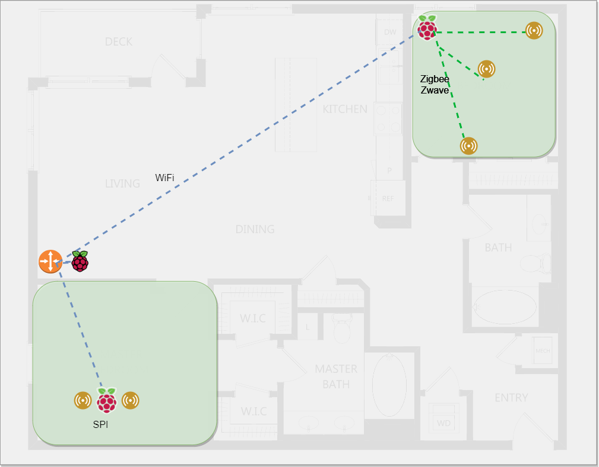
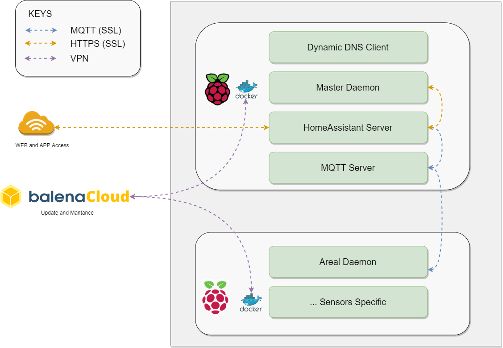
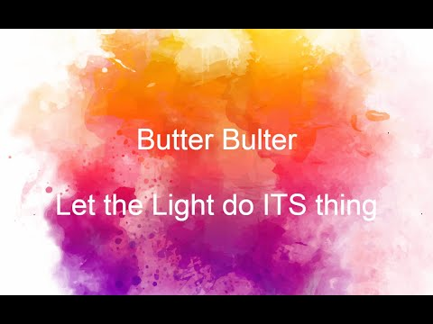

# Product

The product we made is called ButterButler, a revolutionary home assistant for large luxurious villas.\
More details can be found in our [Home Page](https://butterbulter.weebly.com/)


# Fault Tolerance

When we designed the project we understand that things may fail. Which is why we every device we ship will come with a power bank, to overcome short period of power outage (accidentally unplug it).

In our current implementation, each PI Zero is only in charge of a small areal network, communicate with sensor in its area by using SPI or low-powered protocols such as ZWave/ZigBee or BLE(Bluetooth Low Energy). As the result, if the PI Zero breaks, it only affect that area not the whole network.

All the Pi Zeros are connected to hub, where all information are stored. In the future, we are planning allow other Pi Zeros to become a hub if the current hub get discounted.

The current location model are shown below




# Security and Privacy
As we are creating network of connected devices in people's home. It is important to put security and privacy first. To accomplish this:

* We used docker to isolate and containerized every components in all of our devices
* We used encryption for every connections
  - MQTT: All client need have certificate and key pair signed by the same CA to to join the network
  - DockerMaintenance: This is done though VPN, no port forwarding is required
  - UserInterface: HTTPS is used together with login feature to protect user's data (HTTPS not implemented yet)
* All users data are stored locally, making it impossible for disastrous data leak.

Image below provides a more detailed view of all the channels



## Secret Management:
The encrypted channels is only safe when keys are properly looked after, which is why we used step below to generate certificates and keys on the flight.

1. An self-signed CA certificate is generated
2. All clients certificate are signed by the CA's certificate
3. The CA certificate and its keys are deleted, making it imposable to add new clients.

Implementation is shown in script `hub/script/setup_mqtt_tls.sh`

# File Structure
The project directory is split to two part, each developed independently.

## Hub
```
hub
├── config (Configuration for each docker, mounted as volume)
├── docker (Contains docker-compose file for build the docker)
└── script (Scripts used to generate certificate and upload config volumes)
```

## Zero
```
zero
├── da-config (Configuration for the daemon)
├── docker (File to build docker)
└── modules (Source code folder for daemon.py)
    ├── baby_stitch (Demo example)
    └── ... (Other modules)
```
The modules directories contains many sub-folder, each folder contains a collection of code (module) that will be useful in that setup. This offers great flexibility, allows custom solutions by picking relevant packages.

# Running the Docker/Script

## Hub

1. cd to `hub/docker`, run docker compose with `balena`.
2. run `hub/config/config.sh up` to upload all configurations under `config` folder to Raspberry Pi.
3. run `hub/config/setup_mqtt_tls.sh zero` to generate all necessary keys and certificate. Keys for `zero` will be downloaded to `hub/.backhub` folder

## Zero

1. Copy Keys for zero to `zero/da-config`
2. cd to `zero`, run docker compose with `balena`

# Demos

## Baby Monitor

<a href="https://youtu.be/UTIuuA0ERD4"></a>


## Light Off

<a href="https://youtu.be/WFLGXmQCwUE"></a>

## Movie Night

<a href="https://youtu.be/rw3-bpV8qkg"></a>
